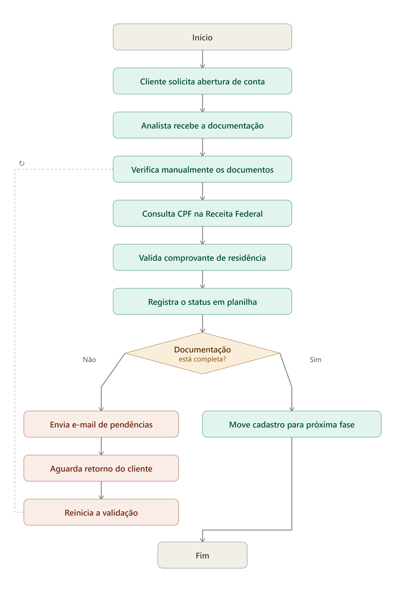
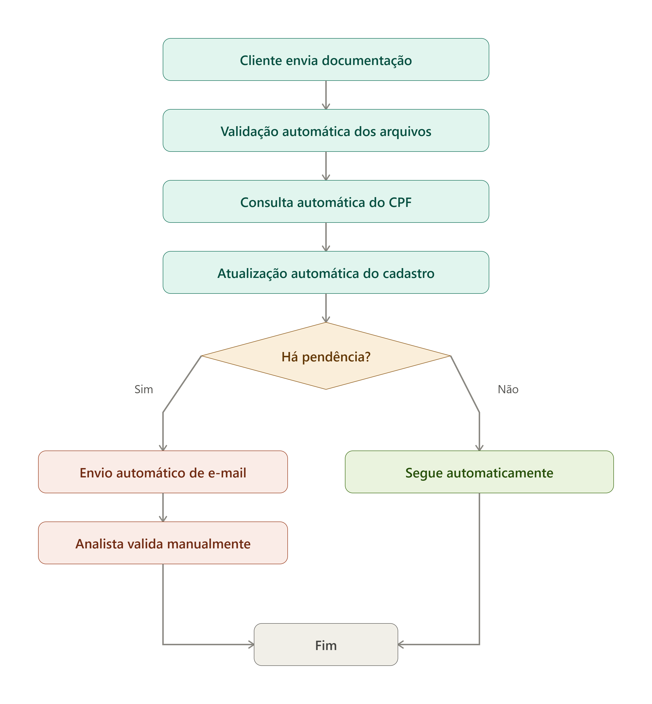

# Seção 7 · Mapeamento BPM, otimização e governança de processos

## Q7.1 — Mapeamento AS-IS (3 pts)
**Prompt:**
"Faça esse fluxo em imagem para mim

```
Início
↓
Cliente solicita abertura de conta
↓
Analista recebe a documentação
↓
Verifica manualmente os documentos
↓
Consulta CPF na Receita Federal
↓
Valida comprovante de residência
↓
Registra o status em planilha
↓
Documentação está completa?
├── Não
│   ↓
│   Envia e-mail solicitando pendências
│   ↓
│   Aguarda retorno do cliente
│   ↓
│   Reinicia a validação
│
└── Sim
    ↓
    Move o cadastro para a próxima fase
    ↓
Fim"
```



## Q7.2 — Proposta TO-BE com business case (4 pts)



| Melhoria                         | Ferramenta               |                      Ganho esperado | Esforço | Risco       |
| -------------------------------- | ------------------------ | ----------------------------------: | ------: | ----------- |
| Consulta automática do CPF       | API Receita              | Redução de aproximadamente 30 h/mês |    20 h | Baixo       |
| Atualização automática do status | Python/RPA               | Redução de aproximadamente 20 h/mês |    12 h | Baixo       |
| Envio automático de e-mails      | Python ou Power Automate | Redução de aproximadamente 15 h/mês |     8 h | Muito baixo |


**Business Case**

Economia mensal de horas:

30 + 20 + 15 = 65 horas/mês

Custo do analista:

65 × R$45 = R$2.925/mês

Supondo um projeto de aproximadamente R$12.000, o payback seria:

R$12.000 ÷ R$2.925 ≈ 4,1 meses

## Q7.3 — Governança e KPIs (3 pts)

| KPI                        | Fórmula                                   | Meta     | Frequência |
| -------------------------- | ----------------------------------------- | -------- | ---------- |
| Tempo médio de cadastro    | Soma dos tempos / quantidade de cadastros | < 15 min | Diário     |
| Cumprimento do SLA         | Cadastros dentro do SLA / total           | > 95%    | Diário     |
| Taxa de retrabalho         | Retrabalhos / total de cadastros          | < 2%     | Semanal    |
| Pendências na documentação | Cadastros com pendência / total           | < 10%    | Semanal    |

**Governança:**
Realizar acompanhamento diário dos indicadores operacionais e uma reunião semanal para avaliar desvios e oportunidades de melhoria. O responsável pelo processo deve acompanhar os KPIs e priorizar ações corretivas quando as metas não forem atingidas. Caso o tempo médio de atendimento, o retrabalho ou o SLA apresentem piora por períodos consecutivos, o fluxo deve ser revisado para identificar a causa e definir ajustes.